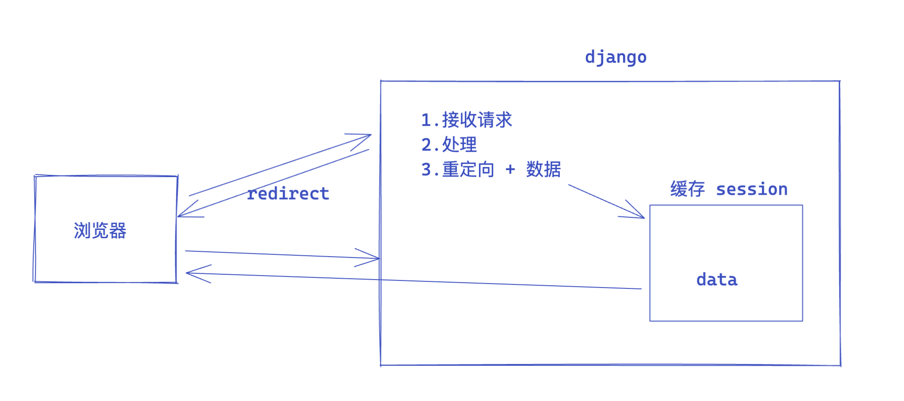
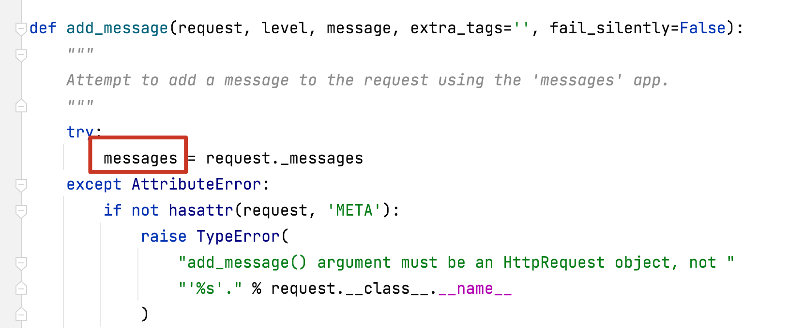
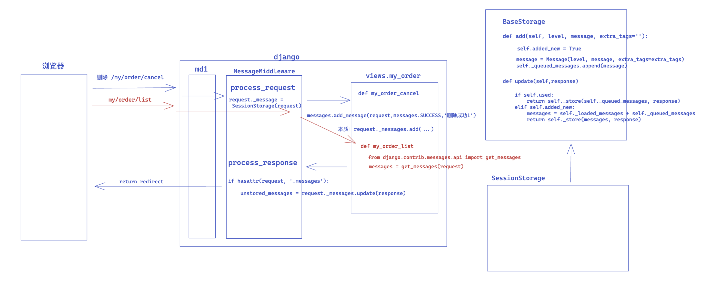

# message组件 


### 1.前戏

**message组件的应用场景**

HTTP请求是不稳定的短链接

如果在**重定向到另外一个url**时希 望返回**重定向之前**的请求相关的数据



message组件在django中是一个app


### 3.应用

#### 3.1 配置

**进行如下配置**

```python
# MESSAGE_STORAGE = 'django.contrib.messages.storage.fallback.FallbackStorage'
# MESSAGE_STORAGE = 'django.contrib.messages.storage.cookie.CookieStorage'
MESSAGE_STORAGE = 'django.contrib.messages.storage.session.SessionStorage'
```

```python
INSTALLED_APPS = [
    # 'django.contrib.admin',
    # 'django.contrib.auth',
    # 'django.contrib.contenttypes',
    # 'django.contrib.sessions',
    'django.contrib.messages',
    'django.contrib.staticfiles',
    "web.apps.WebConfig"
]
```

```python
MIDDLEWARE = [
    'django.middleware.security.SecurityMiddleware',
    'django.contrib.sessions.middleware.SessionMiddleware',
    'django.middleware.common.CommonMiddleware',
    'django.middleware.csrf.CsrfViewMiddleware',
    # 'django.contrib.auth.middleware.AuthenticationMiddleware',
    'django.contrib.messages.middleware.MessageMiddleware',
    'django.middleware.clickjacking.XFrameOptionsMiddleware',
    'utils.md.AuthMiddleware'
]
```

```python
TEMPLATES = [
    {
        'BACKEND': 'django.template.backends.django.DjangoTemplates',
        'DIRS': [],
        'APP_DIRS': True,
        'OPTIONS': {
            'context_processors': [
                'django.template.context_processors.debug',
                'django.template.context_processors.request',
                # 'django.contrib.auth.context_processors.auth',
                'django.contrib.messages.context_processors.messages',
            ],
        },
    },
]
```


**第一种方式**

```python
A请求：
def my_order_cancel(request,pk):
    messages.add_message(request,messages.SUCCESS,'删除成功1')
    messages.add_message(request,messages.SUCCESS,'删除成功2')

    return redirect('my_order_list')
    
B请求：
def f2(request):
	from django.contrib.messages.api import get_messages
   	 	messages = get_messages(request)
    	for obj in messages:
        	print(obj.message)
```


**第二种方式**

```
A请求：
def my_order_cancel(request,pk):
    messages.add_message(request,messages.SUCCESS,'删除成功1')
    messages.add_message(request,messages.SUCCESS,'删除成功2')

    return redirect('my_order_list')
    
B请求：通过HTML页面
   <ul>
        
            <li>{{ obj.message }}</li>
        
    </ul>
```


### 4.源码分析

message是一个对象, 封装特性

add_message 源代码

```python
def add_message(request, level, message, extra_tags='', fail_silently=False):
    """
    Attempt to add a message to the request using the 'messages' app.
    """
    try:
        messages = request._messages
    except AttributeError:
        if not hasattr(request, 'META'):
            raise TypeError(
                "add_message() argument must be an HttpRequest object, not "
                "'%s'." % request.__class__.__name__
            )
        if not fail_silently:
            raise MessageFailure(
                'You cannot add messages without installing '
                'django.contrib.messages.middleware.MessageMiddleware'
            )
    else:
        return messages.add(level, message, extra_tags)
```


关键的两行代码

```python
try:
    messages = request._messages
......
else:
	return messages.add(level, message, extra_tags)
```

```python
request._messages 是request对象中的一个成员

由MessageMiddleware中间件设置，
在MessageMiddleware的process_request方法中设置了_messages
```


default_storage 是一个类，返回如下内容


```
import_string通过字符串形式找类 SessionStorage
返回一个对象，传入request参数
	SessionStorage(request)
```

将SessionStorage(request)对象在中间件MessageMiddleware中的process_request方法

赋值给了request._messages




此处的messages是一个对象，SessionStorage的对象

是因为配置文件中，设置message存放在session中

在SessionStorage的父类BaseStorage中，存在add方法


**请求流程** 



